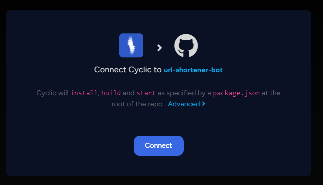
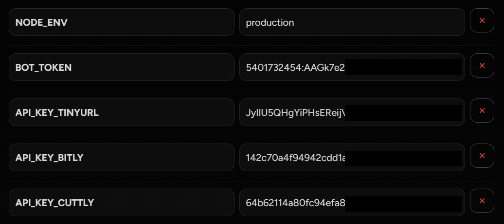

# Url Shortener Telegram Bot Nodejs 🤖

---

Try it out now! [@GetShortUrlBot](https://t.me/GetShortUrlBot)

## Available Bot Commands

-   `/start` Start bot
-   `/help` How to use bot

## Required

-   [Nodejs](https://nodejs.org/) and npm installed.
-   [Git](https://git-scm.com/) installed.

## Get Started

1. Create a bot from Telegram, sending this message to [@BotFather](https://t.me/BotFather) | [Reference](https://core.telegram.org/bots#creating-a-new-bot)

```
/newbot
```

2. Clone this repo

```
git clone https://github.com/jabjabrik/url-shortener-bot.git
cd url-shortener-bot
npm install
```

3. `cp .env.example .env` to create the env file
4. Edit the .env file and set the Bot token & API keys

```
BOT_TOKEN = YOUR_BOT_TOKEN
API_KEY_TINYURL = YOUR_API_KEY_TINYURL
API_KEY_BITLY = YOUR_API_KEY_BITLY
API_KEY_CUTTLY = YOUR_API_KEY_CUTTLY
```

4. Run locally

```
npm run dev
```

## Deploy on [Cyclic](https://app.cyclic.sh)

1. Login to Cyclic using github account
2. Click "New App" to create the project
3. On tab "Link your own" Select your repository
4. Connect..<p align="center"></p>
5. Add some variables like this<p align="center"></p>
6. set webhook `https://api.telegram.org/bot{BOT_TOKEN}/setWebhook?url={URL_PROD}`
7. Bot deployed!!

---


### Star this Repo if you Liked it ⭐⭐⭐
